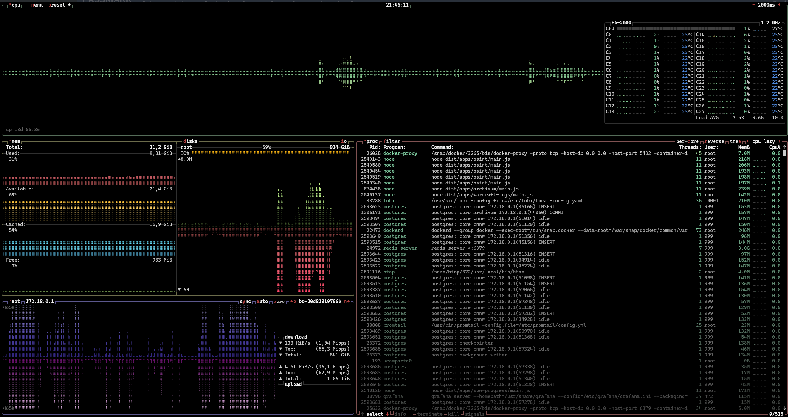
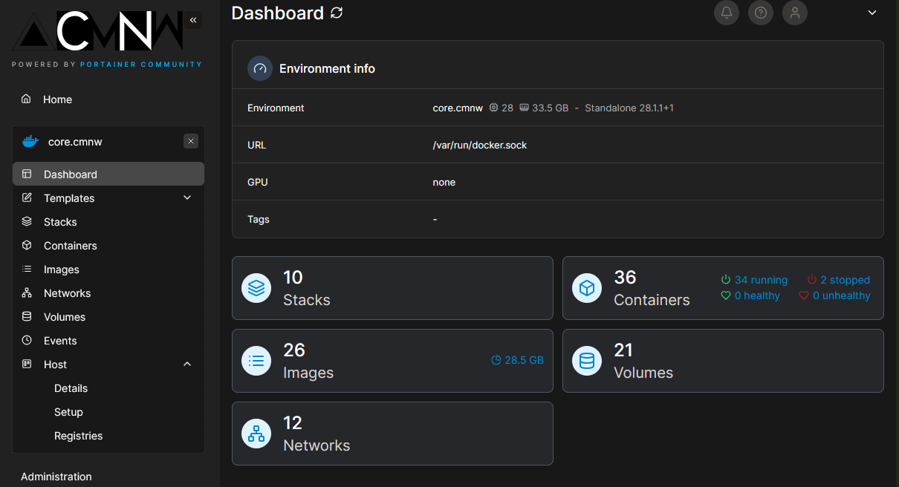
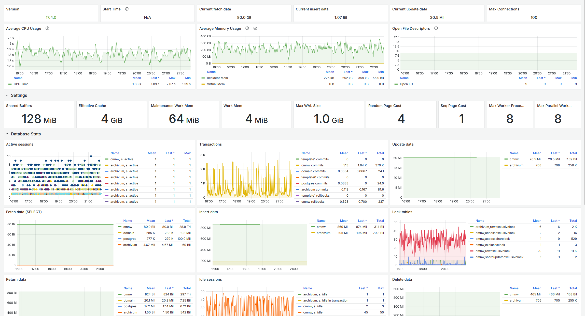
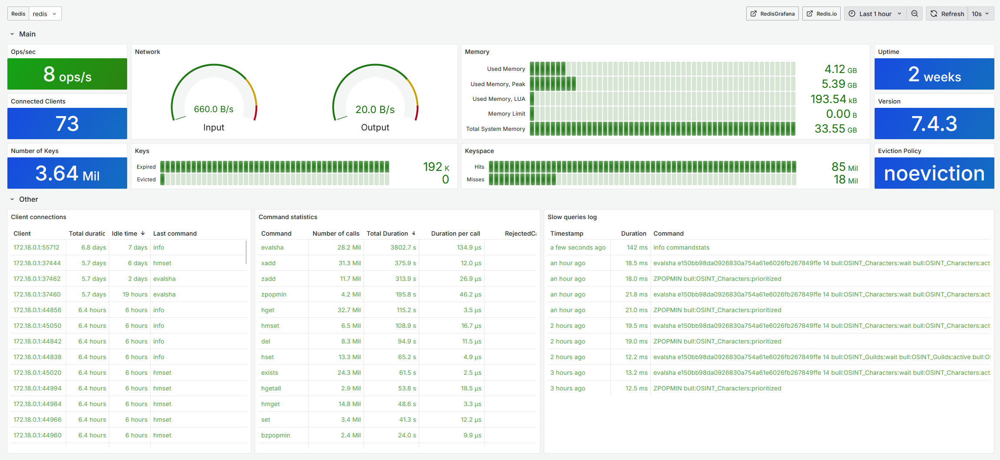

<div align="center">
  <a href="https://cmnw.me/" target="blank">
    
  </a>

  <h1>CORE | CMNW </h1>

  <p>
    
        
    
    
    
    
    
    
    
    
    
    
    
    
    
    
    
    
    
    
    
    
  </p>
</div>

---

## 🏠 Server Overview

**Hostname:** `core.cmnw`  
**Purpose:** Central infrastructure supporting all personal & home projects with 24/7 operations

### 🖥️ Hardware Specifications

- **CPU:** [Intel Xeon E5-2680v4](https://www.cpubenchmark.net/cpu.php?cpu=Intel+Xeon+E5-2680+v4+%40+2.40GHz&id=2779)
- **RAM:** 32GB DDR4
- **Storage:** RAID 10 SSD NVMe array
- **Network:** 1 Gbps SFP Ethernet
- **OS:** Linux (Docker-based containerization)

<div align="center">
  
  <p><em>docker container management interface</em></p>
  
</div>

## 🏗️ Infrastructure Stack

This repository contains the complete infrastructure configuration for a self-hosted server running multiple services across different domains:

### 🔄 Reverse Proxy & Routing
- **Traefik v3.4** - Modern reverse proxy with automatic SSL certificate management
- **Let's Encrypt** integration for free SSL certificates
- **Docker provider** for automatic service discovery

### 🐳 Container Management
- **Portainer** - Web-based Docker container management interface
- **Docker Compose** - Multi-container application orchestration

### 📊 Monitoring & Analytics
- **Prometheus** - Metrics collection and storage
- **Grafana** - Visualization and dashboards
- **Loki** - Log aggregation
- **Promtail** - Log shipping agent
- **PostgreSQL Exporter** - Database metrics

### 🏠 Smart Home
- **Home Assistant** - Central home automation hub
- **Node-RED** - Visual programming for IoT flows
- **Zigbee2MQTT** - Zigbee device management
- **Z-Wave JS UI** - Z-Wave device control
- **Mosquitto** - MQTT message broker
- **InfluxDB** - Time-series database for sensor data

### 💾 Storage & Databases
- **PostgreSQL 17.4** - Primary relational database
- **Redis 7.4.3** - In-memory cache and message broker
- **RabbitMQ** - Message queue for job processing
- **MariaDB** - Additional database server
- **MinIO** - S3-compatible object storage

<div align="center">
  <p><em>requesting data in millions ops</em></p>
  

  
</div>

### 🔧 Development & CI/CD
- **Code Server** - Web-based VS Code environment
- **Portainer** - Docker container management
- **GitHub Runners** - Self-hosted CI/CD runners for:
  - `alexzedim/cmnw` repository
  - `alexzedim/oraculum` repository

## 📁 Project Structure

```
core/
├── docker-compose.analytics.yml    # Monitoring stack
├── docker-compose.example.yml      # Template/example configuration
├── docker-compose.github.yml       # CI/CD runners
├── docker-compose.home.yml         # Home automation services
├── docker-compose.jobs.yml         # Job queue services
├── docker-compose.maria.yml        # MariaDB database
├── docker-compose.routing.yml      # Traefik reverse proxy
├── docker-compose.s3.yml           # MinIO object storage
├── docker-compose.storage.yml      # PostgreSQL & Redis
├── traefik/                        # Traefik configuration
│   ├── traefik.yml                 # Main Traefik config
│   ├── dynamic.yml                 # Dynamic configuration
│   └── acme.json                   # SSL certificates
├── prometheus/                     # Prometheus configuration
│   └── prometheus.yml
├── loki/                          # Loki log aggregation
│   └── loki-config.yaml
└── mosquitto/                     # MQTT broker config
    └── mosquitto.conf
```

## 🚀 Services Overview

### Core Infrastructure
| Service | Port | Purpose |
|---------|------|---------|
| Traefik | 80, 443, 9000 | Reverse proxy & SSL termination |
| PostgreSQL | 5432 | Primary database |
| Redis | 6379 | Cache & message broker |
| MariaDB | 3306 | Additional database |
| MinIO | 9000, 9001 | S3-compatible storage |

### Home Automation
| Service | Port | Purpose |
|---------|------|---------|
| Home Assistant | Host | Home automation hub |
| Node-RED | 1880 | IoT flow programming |
| Zigbee2MQTT | 8080 | Zigbee device management |
| Z-Wave JS UI | 8091 | Z-Wave device control |
| Mosquitto | 1883 | MQTT message broker |
| InfluxDB | 8086 | Time-series data |

### Monitoring & Analytics
| Service | Port | Purpose |
|---------|------|---------|
| Grafana | 3000 | Dashboards & visualization |
| Prometheus | 9090 | Metrics collection |
| Loki | 3100 | Log aggregation |
| Promtail | - | Log shipping |
| PostgreSQL Exporter | 9187 | Database metrics |

### Development Tools
| Service | Port | Purpose |
|---------|------|---------|
| Code Server | 8443 | Web-based VS Code |
| Portainer | 9000 | Docker container management |
| GitHub Runners | - | CI/CD execution |
| RabbitMQ | 15672, 5672 | Message queue |

## 🔧 Configuration Management

### Environment Variables
Services are configured using environment files:
- `stack.env` - Shared environment variables
- Individual `.env` files for specific stacks

### Networking
- **Bridge networks** for service isolation
- **Host networking** for Home Assistant (hardware access)
- **Traefik labels** for automatic service discovery

### Storage
- **Named volumes** for persistent data
- **Bind mounts** for configuration files
- **RAID 10 SSD NVMe** for high-performance storage

## 🛠️ Deployment

### Prerequisites
- Docker & Docker Compose
- Linux host with Docker support
- Network access for Let's Encrypt certificates

### Quick Start
```bash
# Clone the repository
git clone <repository-url>
cd core

# Start individual stacks
docker-compose -f docker-compose.routing.yml up -d
docker-compose -f docker-compose.storage.yml up -d
docker-compose -f docker-compose.home.yml up -d
docker-compose -f docker-compose.analytics.yml up -d
# ... etc
```

### Service Management
```bash
# View running services
docker ps

# Check service logs
docker-compose -f docker-compose.home.yml logs -f

# Restart specific service
docker-compose -f docker-compose.home.yml restart home-assistant
```

## 📈 Monitoring & Maintenance

### Health Checks
- All services include health check configurations
- Prometheus metrics for system monitoring
- Grafana dashboards for visualization

### Backup Strategy
- Database volumes are persisted
- Configuration files are version controlled
- Regular backups of critical data

### Security
- Traefik handles SSL/TLS termination
- Services run with minimal privileges
- Network isolation between stacks
- Environment-based secrets management

## 📝 Notes

- All services are configured for 24/7 operation
- Automatic restart policies ensure high availability
- Resource limits are configured for optimal performance
- The server supports multiple personal projects simultaneously
- RAID 10 configuration provides both performance and redundancy

---

**Maintained by:** alexzedim
