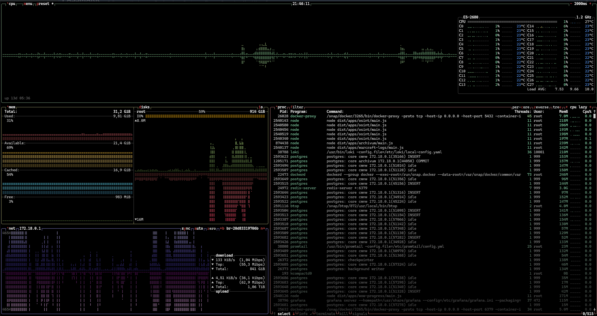
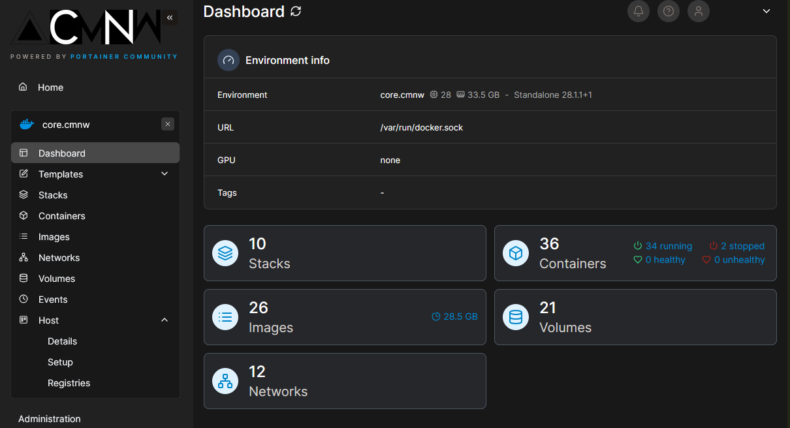
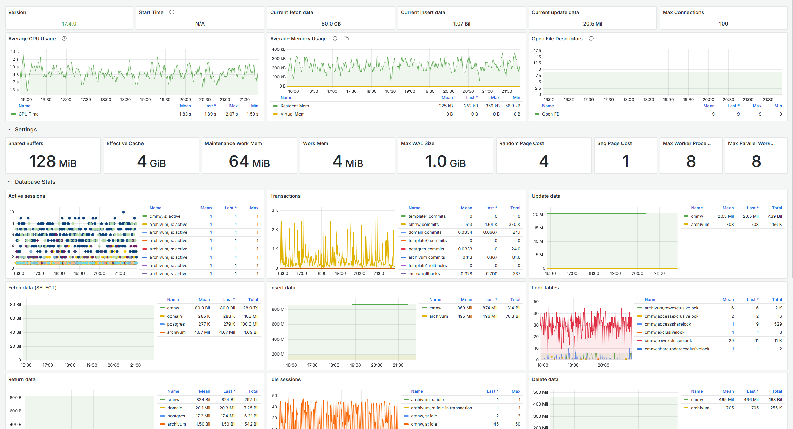
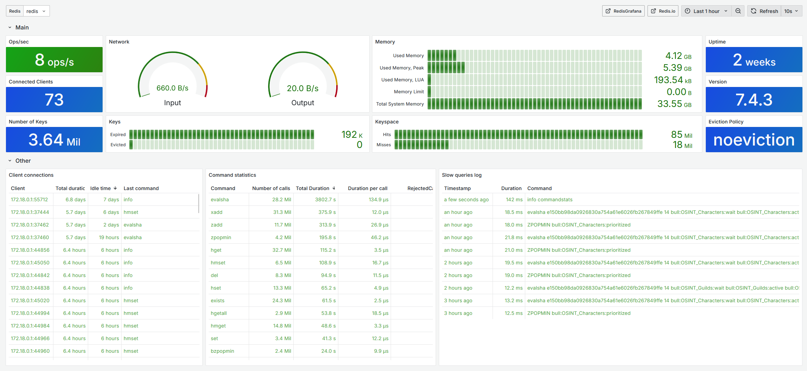

<div align="center">
  <a href="https://cmnw.me/" target="blank">
    
  </a>

  <h1>CORE | CMNW</h1>

  <p>
    
    
    
    
    
    
    
    
    
    
    
    
    
    
    
    
    
    
    
    
    
    
  </p>
</div>

---

## 🏠 Server Overview

**Hostname:** `core.cmnw`  
**Purpose:** Central infrastructure supporting all personal & home projects with 24/7 operations

### 🖥️ Hardware Specifications

- **CPU:** [Intel Xeon E5-2680v4](https://www.cpubenchmark.net/cpu.php?cpu=Intel+Xeon+E5-2680+v4+%40+2.40GHz&id=2779)
- **RAM:** 32GB DDR4
- **Storage:** RAID 10 SSD NVMe array
- **Network:** 1 Gbps SFP Ethernet
- **OS:** Linux (Docker-based containerization)

<div align="center">
  
  <p><em>docker container management interface</em></p>
  
</div>

## 🏗️ Infrastructure Stack

This repository contains the complete infrastructure configuration for a self-hosted server running multiple services across different domains:

### 🔄 Reverse Proxy & Routing
- **Nginx 1.27** — SSL termination and reverse proxy
- **Nginx-UI** — Web-based nginx configuration management
- **Nginx Prometheus Exporter** — Metrics for monitoring
- Multi-domain support: `cmnw.me`, `cmnw.xyz`, `cmnw.ru`
- GitLab SSH proxy via nginx `stream` block (port `2222`)

### 🐳 Container Management
- **Portainer** — Web-based Docker container management interface
- **Docker Compose** — Multi-container application orchestration

### 📊 Monitoring & Analytics
- **Prometheus** — Metrics collection and storage
- **Grafana** — Visualization and dashboards
- **Loki** — Log aggregation
- **Promtail** — Log shipping agent
- **Postgres Exporter** — Database metrics
- **Nginx Prometheus Exporter** — Nginx metrics

### 🏠 Smart Home
- **Home Assistant** — Central home automation hub
- **Node-RED** — Visual programming for IoT flows
- **Zigbee2MQTT** — Zigbee device management
- **Z-Wave JS UI** — Z-Wave device control
- **Mosquitto** — MQTT message broker
- **InfluxDB** — Time-series database for sensor data

### 💾 Storage & Databases
- **PostgreSQL 17.4** — Primary relational database
- **Redis 7.4.3** — In-memory cache and message broker
- **RabbitMQ 4.2.2** — Message queue for job processing
- **MinIO** — S3-compatible object storage

<div align="center">
  <p><em>requesting data in millions ops</em></p>
  

  
</div>

### 🤖 AI & Machine Learning
- **Ollama** — LLM inference engine
- **Open WebUI** — ChatGPT-style web interface for Ollama
- **Qdrant** — Vector database for embeddings and similarity search
- **GitHub MCP Server** — Model Context Protocol server for GitHub
- **Grafana MCP** — Model Context Protocol server for Grafana

### 🔧 Development & CI/CD
- **GitLab CE** — Self-hosted Git repository manager
- **GitHub Runners** — 5 self-hosted CI/CD runners:
  - 3× for `alexzedim/cmnw` repository
  - 2× for `alexzedim/oraculum` repository

## 📁 Project Structure

```
core/
├── docker-compose.storage.yml      # PostgreSQL, Redis, MinIO, RabbitMQ
├── docker-compose.routing.yml      # Nginx, Nginx-UI, Nginx metrics exporter
├── docker-compose.analytics.yml    # Prometheus, Grafana, Loki, Promtail
├── docker-compose.home.yml         # Home Assistant, Node-RED, Mosquitto, InfluxDB
├── docker-compose.git.yml          # GitHub self-hosted runners (5×)
├── docker-compose.gitlab.yml       # GitLab CE
├── docker-compose.ai.yml           # Ollama, Open WebUI, Qdrant, MCP servers
├── docker-compose.control.yml      # Portainer
├── docker-compose.ai-local.yml     # Local AI with NVIDIA GPU support
├── docker-compose.example.yml      # Template / documentation
├── nginx/
│   ├── nginx.conf                  # Main nginx config
│   ├── conf.d/                     # Per-site server blocks
│   │   ├── cmnw.conf               # Main site + API proxy
│   │   ├── gitlab.conf             # GitLab reverse proxy
│   │   ├── metrics.conf            # Nginx stub_status
│   │   └── qdrant.conf             # Qdrant REST + gRPC proxy
│   └── .certs/                     # SSL certificates (gitignored)
├── prometheus/
│   └── prometheus.yml              # Standalone reference config
├── loki/
│   └── loki-config.yaml            # Loki retention config
├── qdrant/
│   └── config/config.yaml          # Qdrant vector DB config
├── mosquitto/
│   └── mosquitto.conf              # MQTT broker config
├── nginx-ui/
│   └── app.ini                     # Nginx-UI configuration
├── gitlab/
│   └── config/gitlab.rb            # GitLab configuration
└── .env                            # Environment variables (gitignored)
```

## 🚀 Services Overview

### Core Infrastructure
| Service | Port | Purpose |
|---------|------|---------|
| Nginx | 80, 443, 2222 | Reverse proxy, SSL termination, GitLab SSH |
| Nginx-UI | 9080 | Nginx configuration management |
| PostgreSQL | 5432 | Primary database |
| Redis | 6379 | Cache & message broker |
| MinIO | 9000, 9001 | S3-compatible storage |
| RabbitMQ | 5672, 15672 | Message queue |

### Home Automation
| Service | Port | Purpose |
|---------|------|---------|
| Home Assistant | 8123 (host) | Home automation hub |
| Node-RED | 1880 | IoT flow programming |
| Zigbee2MQTT | 8080 | Zigbee device management |
| Z-Wave JS UI | 8091 | Z-Wave device control |
| Mosquitto | 1883 | MQTT message broker |
| InfluxDB | 8086 | Time-series data |

### Monitoring & Analytics
| Service | Port | Purpose |
|---------|------|---------|
| Grafana | 3000 | Dashboards & visualization |
| Prometheus | 9090 | Metrics collection |
| Loki | 3100 | Log aggregation |
| Promtail | — | Log shipping |
| Nginx Exporter | 9113 | Nginx metrics |
| Postgres Exporter | 9187 | Database metrics |

### AI & Machine Learning
| Service | Port | Purpose |
|---------|------|---------|
| Ollama | 11434 | LLM inference API |
| Open WebUI | 3080 | Web chat interface |
| Qdrant | 6333, 6334 | Vector database (REST + gRPC) |
| GitHub MCP | 3001 | GitHub MCP server |
| Grafana MCP | 8001 | Grafana MCP server |

### Development & CI/CD
| Service | Port | Purpose |
|---------|------|---------|
| GitLab CE | 8083, 8443 | Self-hosted Git platform |
| GitHub Runners | — | CI/CD execution (5 runners) |
| Portainer | 8000, 9443 | Docker management UI |

## 🔧 Configuration Management

### Environment Variables
- `.env` — Secrets and configuration values (gitignored, never committed)
- `stack.env` — Used by home stack services via `env_file`

### Networking
- **`cmnw` external network** — Shared across stacks for cross-service communication
- **Bridge networks** for per-stack isolation (`storage-network`, `loki`, `runner-network`, `edge`)
- **Host networking** for Home Assistant (hardware access required)
- Nginx proxies all HTTPS traffic to upstream services

### Storage
- **Named volumes** with bind mounts to `/mnt/` for services requiring known host paths
- **Standard named volumes** for services with Docker-managed data
- **RAID 10 SSD NVMe** for high-performance storage

## 🛠️ Deployment

### Prerequisites
- Docker & Docker Compose
- Linux host with Docker support
- Pre-created `cmnw` external network: `docker network create cmnw`
- Host directories under `/mnt/` for bind-mounted volumes

### Quick Start
```bash
# Create shared network
docker network create cmnw

# Start stacks in order
docker-compose -f docker-compose.storage.yml up -d
docker-compose -f docker-compose.routing.yml up -d
docker-compose -f docker-compose.analytics.yml up -d
docker-compose -f docker-compose.home.yml up -d
docker-compose -f docker-compose.ai.yml up -d
docker-compose -f docker-compose.gitlab.yml up -d
docker-compose -f docker-compose.git.yml up -d
docker-compose -f docker-compose.control.yml up -d
```

### Service Management
```bash
# Validate before applying changes
docker-compose -f docker-compose.<stack>.yml config

# View running services
docker ps

# Check service logs
docker-compose -f docker-compose.home.yml logs -f

# Restart specific service
docker-compose -f docker-compose.storage.yml restart postgres

# Reload nginx after config change
docker exec cmnw-nginx nginx -s reload
```

## 📈 Monitoring & Maintenance

### Health Checks
- All database services include health check configurations
- Prometheus scrapes metrics from nginx, PostgreSQL, RabbitMQ, MinIO, Home Assistant, Qdrant
- Grafana dashboards for visualization

### Backup Strategy
- Database volumes are persisted
- Configuration files are version controlled
- PostgreSQL backup: `docker exec postgres pg_dump -U postgres cmnw > backup_$(date +%Y%m%d).sql`

### Security
- Nginx handles SSL/TLS termination with per-domain certificates
- TLSv1.2 + TLSv1.3 only, modern cipher suites
- HSTS headers on all HTTPS virtual hosts
- Services run with minimal privileges
- Network isolation between stacks
- Environment-based secrets management (`.env`, gitignored)

## 📝 Notes

- All services are configured for 24/7 operation
- Automatic restart policies ensure high availability
- Resource limits are configured for GitHub Actions runners
- The server supports multiple personal projects simultaneously
- RAID 10 configuration provides both performance and redundancy

---

**Maintained by:** alexzedim
