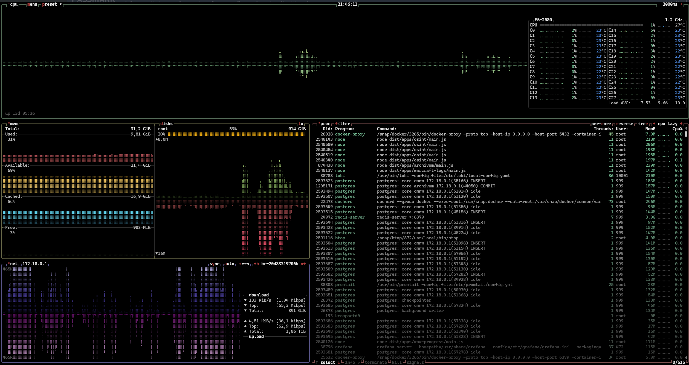
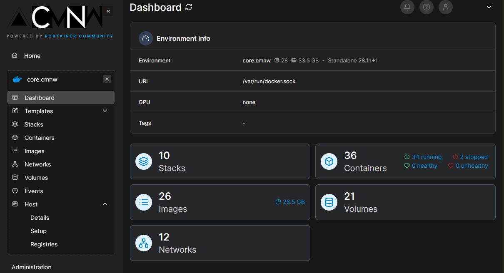
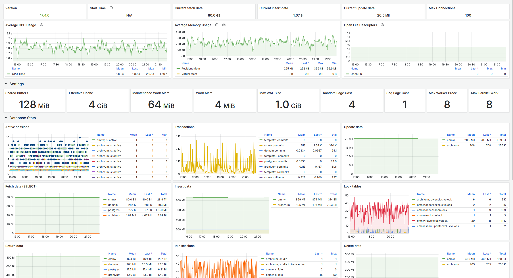
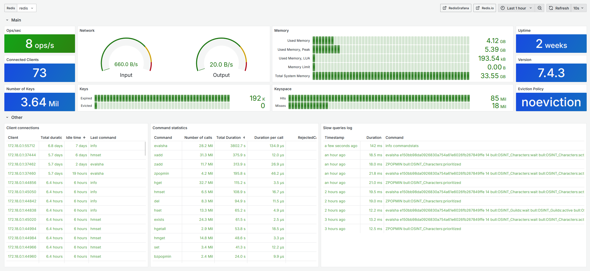

<div align="center">
  <a href="https://cmnw.me/" target="blank">
    
  </a>

  <h1>CORE | CMNW</h1>

  <p>Infrastructure-as-code for a self-hosted server running containerized services across storage, routing, analytics, home automation, AI and CI/CD — orchestrated with Docker Compose behind an Nginx reverse proxy.</p>
</div>

---

## 🏠 Server Overview

### 🖥️ Hardware

- **CPU:** [Intel Xeon E5-2680v4](https://www.cpubenchmark.net/cpu.php?cpu=Intel+Xeon+E5-2680+v4+%40+2.40GHz&id=2779)
- **RAM:** 32GB DDR4
- **Storage:** RAID 10 SSD NVMe array
- **Network:** 1 Gbps SFP Ethernet
- **OS:** Linux (Docker-based containerization)

<div align="center">
  
  <p><em>docker container management interface</em></p>
  
</div>

## ⚡ Tech Stack

<div align="center">

#### 🔄 Edge & Network

</div>
<div align="center">
<table align="center">
<tr align="center">
    <td valign="bottom"><br/>Nginx</td>
    <td valign="bottom"><br/>AdGuard</td>
</tr>
</table>
</div>

<div align="center">

#### 💾 Data & Storage

</div>
<div align="center">
<table align="center">
<tr align="center">
    <td valign="bottom"><br/>PostgreSQL</td>
    <td valign="bottom"><br/>pgvector</td>
    <td valign="bottom"><br/>Redis</td>
    <td valign="bottom"><br/>RabbitMQ</td>
    <td valign="bottom"><br/>MinIO</td>
    <td valign="bottom"><br/>InfluxDB</td>
</tr>
</table>
</div>

<div align="center">

#### 📊 Monitoring & Observability

</div>
<div align="center">
<table align="center">
<tr align="center">
    <td valign="bottom"><br/>Prometheus</td>
    <td valign="bottom"><br/>Grafana</td>
    <td valign="bottom"><br/>Loki</td>
</tr>
</table>
</div>

<div align="center">

#### 🏠 Smart Home

</div>
<div align="center">
<table align="center">
<tr align="center">
    <td valign="bottom"><br/>Home Assistant</td>
    <td valign="bottom"><br/>Node-RED</td>
    <td valign="bottom"><br/>Zigbee2MQTT</td>
    <td valign="bottom"><br/>Z-Wave JS UI</td>
    <td valign="bottom"><br/>Mosquitto</td>
</tr>
</table>
</div>

<div align="center">

#### 🤖 AI & RAG

</div>
<div align="center">
<table align="center">
<tr align="center">
    <td valign="bottom"><br/>LightRAG</td>
    <td valign="bottom"><br/>OpenRouter</td>
    <td valign="bottom"><br/>Ollama</td>
    <td valign="bottom"><br/>Open WebUI</td>
    <td valign="bottom"><br/>MCP</td>
</tr>
</table>
</div>

<div align="center">

#### ⚙️ Runtime

</div>
<div align="center">
<table align="center">
<tr align="center">
    <td valign="bottom"><br/>Node.js</td>
    <td valign="bottom"><br/>TypeScript</td>
    <td valign="bottom"><br/>Python</td>
</tr>
</table>
</div>

<div align="center">

#### 🔧 CI/CD & DevOps

</div>
<div align="center">
<table align="center">
<tr align="center">
    <td valign="bottom"><br/>Docker</td>
    <td valign="bottom"><br/>GitLab</td>
    <td valign="bottom"><br/>GitHub Actions</td>
    <td valign="bottom"><br/>Portainer</td>
    <td valign="bottom"><br/>Ubuntu</td>
</tr>
</table>
</div>

## 🧱 Compose Stacks

| Stack | Services | Networks |
|-------|----------|----------|
| `docker-compose.storage.yml` | PostgreSQL 17.4, Redis 7.4.3, MinIO, RabbitMQ 4.2.2, RabbitScout, pgvector 0.8.6 (LightRAG DB) | `storage-network`, `cmnw` |
| `docker-compose.routing.yml` | Nginx 1.27, Nginx-UI, Nginx Prometheus Exporter | `edge`, `cmnw` |
| `docker-compose.analytics.yml` | Prometheus, Promtail, Loki 3.6.3, Grafana, Node Exporter, Postgres Exporter | `loki`, `cmnw` |
| `docker-compose.home.yml` | Home Assistant, Mosquitto, Node-RED, Zigbee2MQTT, Z-Wave JS UI, InfluxDB 2 | `host` (HA), `traefik` (ext) |
| `docker-compose.git.yml` | 5× GitHub Actions runners, docker-prune janitor | `runner-network` |
| `docker-compose.gitlab.yml` | GitLab CE 19.0.1 | `cmnw` |
| `docker-compose.oracle.yml` | 6× vpn-oracle AdGuard VPN gateways + `oracle` / `-1d` / `-2bd` / `-3s` / `-4qr` / `-5se` | `oraculum`, `cmnw` |
| `docker-compose.oraculum.yml` | indexator, oracular, archivum, gateway, LightRAG | `oraculum` |
| `docker-compose.ai.yml` | GitHub MCP, Grafana MCP, Open WebUI | `cmnw` |
| `docker-compose.control.yml` | Portainer CE | `traefik` (ext) |
| `docker-compose.ai-local.yml` | Ollama + Open WebUI (NVIDIA GPU passthrough) | `ai-local-network` |

<div align="center">
  <p><em>requesting data in millions ops</em></p>
  
  
</div>

## ✨ Highlights

- **Multi-domain TLS routing** — SSL-terminated reverse proxy serving `cmnw.me`, `cmnw.xyz`, `cmnw.ru`
- **Full observability stack** — Prometheus metrics, Grafana dashboards, Loki log aggregation with 30-day retention
- **Smart home automation** — Home Assistant hub with Zigbee and Z-Wave device meshes over MQTT
- **Graph-RAG platform** — LightRAG (private fork) with graph + vectors in PostgreSQL/pgvector, inference routed via OpenRouter
- **Egress VPN fleet** — six AdGuard VPN gateways powering the oracle farm
- **CI/CD pipeline** — self-hosted GitHub Actions runners building straight into the local Docker daemon
- **Infrastructure as code** — every service defined in version-controlled Docker Compose files, deployed via Portainer

## 📁 Project Structure

```
core/
├── docker-compose.storage.yml      # PostgreSQL, Redis, MinIO, RabbitMQ, pgvector
├── docker-compose.routing.yml      # Nginx, Nginx-UI, metrics exporter
├── docker-compose.analytics.yml    # Prometheus, Grafana, Loki, Promtail
├── docker-compose.home.yml         # Home Assistant, Node-RED, Zigbee2MQTT, Z-Wave, InfluxDB
├── docker-compose.git.yml          # GitHub Actions runners (5×), docker-prune
├── docker-compose.gitlab.yml       # GitLab CE
├── docker-compose.oracle.yml       # AdGuard VPN gateways + oracle apps
├── docker-compose.oraculum.yml     # indexator, oracular, archivum, gateway, LightRAG
├── docker-compose.ai.yml           # GitHub MCP, Grafana MCP, Open WebUI
├── docker-compose.control.yml      # Portainer
├── docker-compose.ai-local.yml     # Ollama + Open WebUI (GPU passthrough)
├── docker-compose.example.yml      # template / documentation
├── nginx/                          # reference nginx configs
├── prometheus/                     # reference prometheus config
├── loki/                           # reference loki config
├── mosquitto/                      # mosquitto config
├── icons/                          # README icon assets
└── images/                         # README screenshots
```

---

**Maintained by:** [alexzedim](https://github.com/alexzedim) · operational conventions in [AGENTS.md](./AGENTS.md)
