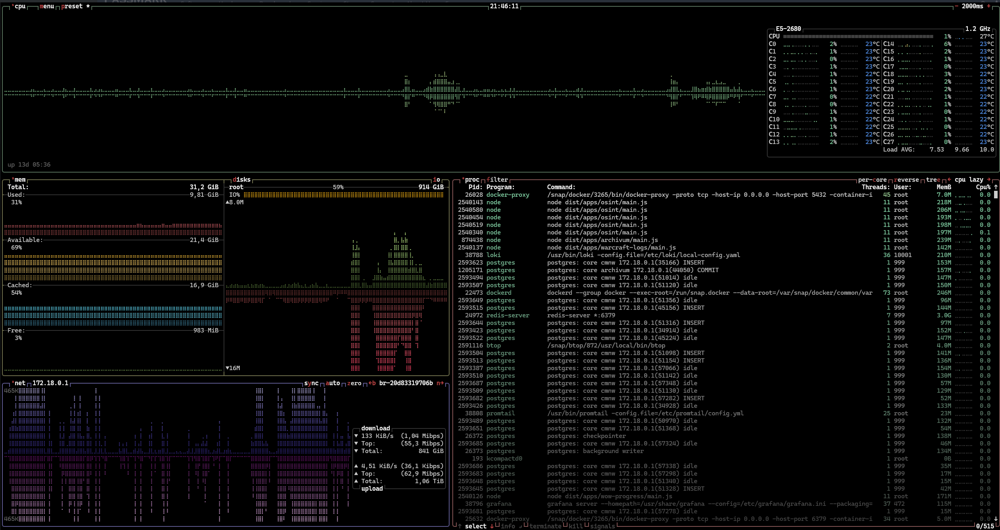
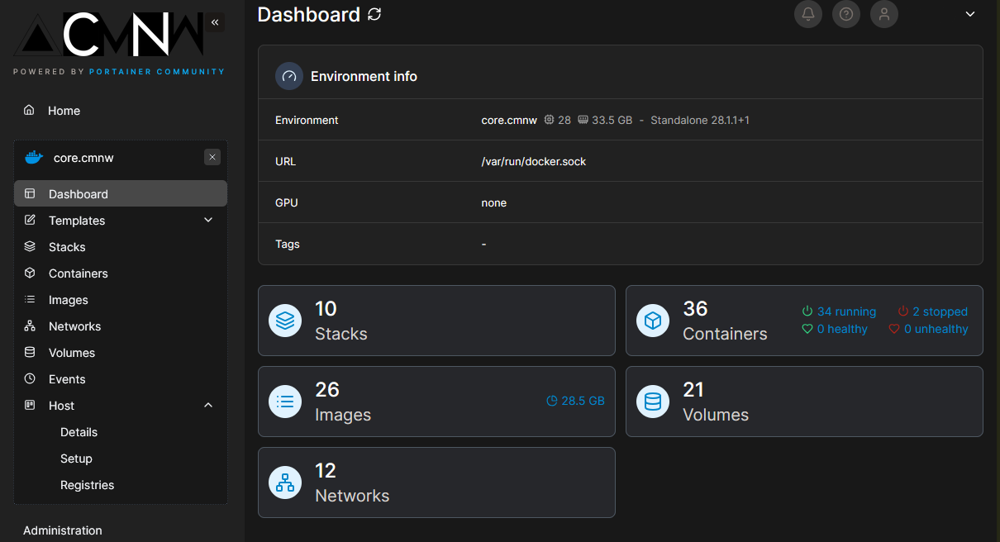
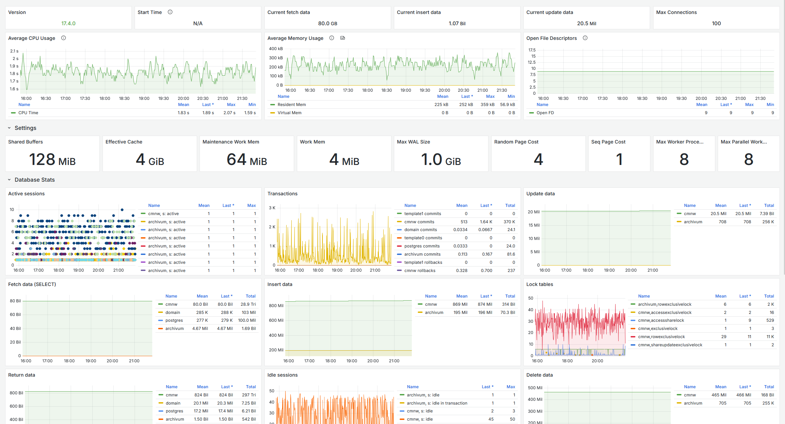
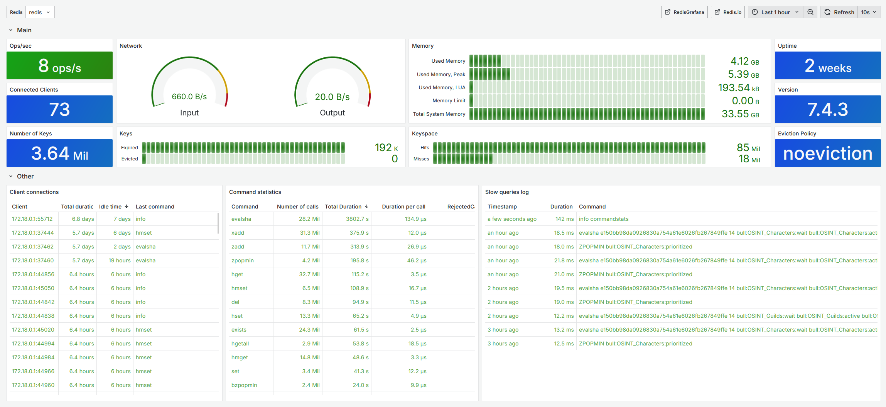

<div align="center">
  <a href="https://cmnw.me/" target="blank">
    
  </a>

  <h1>CORE | CMNW</h1>

  <p>Infrastructure-as-code for a self-hosted server running containerized services across storage, routing, analytics, home automation, AI and CI/CD — orchestrated with Docker Compose behind a Caddy reverse proxy.</p>
</div>

---

## 🏠 Server Overview

### 🖥️ Hardware

- **CPU:** [Intel Xeon E5-2680v4](https://www.cpubenchmark.net/cpu.php?cpu=Intel+Xeon+E5-2680+v4+%40+2.40GHz&id=2779)
- **RAM:** 32GB DDR4
- **Storage:** RAID 10 SSD NVMe array
- **Network:** 1 Gbps SFP Ethernet
- **OS:** Linux (Docker-based containerization)

<div align="center">
  
  <p><em>docker container management interface</em></p>
  
</div>

## ⚡ Tech Stack

<div align="center">

#### 🔄 Edge & Network

</div>
<div align="center">
<table align="center">
<tr align="center">
    <td valign="bottom"><br/>Caddy</td>
    <td valign="bottom"><br/>AdGuard</td>
</tr>
</table>
</div>

<div align="center">

#### 💾 Data & Storage

</div>
<div align="center">
<table align="center">
<tr align="center">
    <td valign="bottom"><br/>PostgreSQL</td>
    <td valign="bottom"><br/>pgvector</td>
    <td valign="bottom"><br/>Redis</td>
    <td valign="bottom"><br/>RabbitMQ</td>
    <td valign="bottom"><br/>MinIO</td>
</tr>
</table>
</div>

<div align="center">

#### 📊 Monitoring & Observability

</div>
<div align="center">
<table align="center">
<tr align="center">
    <td valign="bottom"><br/>Prometheus</td>
    <td valign="bottom"><br/>Grafana</td>
    <td valign="bottom"><br/>Loki</td>
</tr>
</table>
</div>

<div align="center">

#### 🏠 Smart Home

</div>
<div align="center">
<table align="center">
<tr align="center">
    <td valign="bottom"><br/>Home Assistant</td>
</tr>
</table>
</div>

<div align="center">

#### 🤖 AI & RAG

</div>
<div align="center">
<table align="center">
<tr align="center">
    <td valign="bottom"><br/>LightRAG</td>
    <td valign="bottom"><br/>OpenRouter</td>
    <td valign="bottom"><br/>Ollama</td>
    <td valign="bottom"><br/>Open WebUI</td>
    <td valign="bottom"><br/>MCP</td>
</tr>
</table>
</div>

<div align="center">

#### ⚙️ Runtime

</div>
<div align="center">
<table align="center">
<tr align="center">
    <td valign="bottom"><br/>Node.js</td>
    <td valign="bottom"><br/>TypeScript</td>
    <td valign="bottom"><br/>Python</td>
</tr>
</table>
</div>

<div align="center">

#### 🔧 CI/CD & DevOps

</div>
<div align="center">
<table align="center">
<tr align="center">
    <td valign="bottom"><br/>Docker</td>
    <td valign="bottom"><br/>GitLab</td>
    <td valign="bottom"><br/>GitHub Actions</td>
    <td valign="bottom"><br/>Portainer</td>
    <td valign="bottom"><br/>Ubuntu</td>
</tr>
</table>
</div>

## 🧱 Compose Stacks

| Stack | Services | Networks |
|-------|----------|----------|
| `compose.storage.yaml` | PostgreSQL 17.4, Redis 7.4.3, MinIO, RabbitMQ 4.2.2, RabbitScout, pgvector 0.8.6 (LightRAG DB) | `storage-network`, `cmnw` |
| `compose.routing.yaml` | Caddy (panel build), caddy-proxy-manager, docker-socket-proxy, l4-port-manager, cert-sync | `edge`, `cmnw`, `routing-internal`, `socket-proxy` |
| `compose.analytics.yaml` | Prometheus, Promtail, Loki 3.6.3, Grafana, Postgres Exporter | `loki`, `cmnw` |
| `compose.home.yaml` | Home Assistant 2026.9.4 (LAN-only :8123, host network for mDNS) | `host` |
| `compose.git.yaml` | 5× GitHub Actions runners (3× cmnw, 2× oraculum), docker-prune janitor | `runner-network` |
| `compose.gitlab.yaml` | GitLab CE 19.0.1 + gitlab-ssh socat relay (host :2222) | `cmnw` |
| `compose.oracle.yaml` | 4× vpn-oracle AdGuard VPN gateways + `oracle` / `-1d` / `-2bd` / `-3s` | `oraculum`, `cmnw` (ext) |
| `compose.oraculum.yaml` | indexator, oracular, archivum, gateway, LightRAG | `oraculum` |
| `compose.ai.yaml` | GitHub MCP, Grafana MCP | `cmnw` |
| `compose.control.yaml` | Portainer CE | default |
| `compose.ai-local.yaml` | Ollama + Open WebUI (NVIDIA GPU passthrough) | `ai-local-network` |

<div align="center">
  <p><em>requesting data in millions ops</em></p>
  
  
</div>

## ✨ Highlights

- **Multi-domain TLS routing** — Caddy (HTTP/3/QUIC) behind caddy-proxy-manager serving `cmnw.me`, `cmnw.xyz`, `cmnw.ru`
- **Full observability stack** — Prometheus metrics, Grafana dashboards, Loki log aggregation with 30-day retention
- **Smart home automation** — single-service Home Assistant on the host network (LAN-only) driving Wi-Fi/cloud devices via HACS integrations
- **Graph-RAG platform** — LightRAG (private fork) with graph + vectors in PostgreSQL/pgvector, inference routed via OpenRouter
- **Egress VPN fleet** — four AdGuard VPN gateways powering the oracle farm
- **CI/CD pipeline** — self-hosted GitHub Actions runners building the stack's images
- **Infrastructure as code** — every service defined in version-controlled Docker Compose files, deployed via Portainer

## 📁 Project Structure

```
core/
├── compose.storage.yaml      # PostgreSQL, Redis, MinIO, RabbitMQ, pgvector
├── compose.routing.yaml      # Caddy, caddy-proxy-manager, cert-sync, socket proxy
├── compose.analytics.yaml    # Prometheus, Grafana, Loki, Promtail
├── compose.home.yaml         # Home Assistant (single service, LAN-only)
├── compose.git.yaml          # GitHub Actions runners (5×), docker-prune
├── compose.gitlab.yaml       # GitLab CE
├── compose.oracle.yaml       # AdGuard VPN gateways + oracle apps
├── compose.oraculum.yaml     # indexator, oracular, archivum, gateway, LightRAG
├── compose.ai.yaml           # GitHub MCP, Grafana MCP
├── compose.control.yaml      # Portainer
├── compose.ai-local.yaml     # Ollama + Open WebUI (GPU passthrough)
├── compose.example.yaml      # template / documentation
├── .github/workflows         # CI: cert-sync + caddy-panel image builds
├── cert-sync/                # Selectel CM → panel certificate delivery
├── caddy-panel/              # patch build of caddy-proxy-manager images
├── prometheus/               # reference prometheus config
├── loki/                     # reference loki config
├── mosquitto/                # legacy reference config
├── qdrant/                   # legacy reference config
├── icons/                    # README icon assets
└── images/                   # README screenshots
```

---

**Maintained by:** [alexzedim](https://github.com/alexzedim) · operational conventions in [AGENTS.md](./AGENTS.md)
